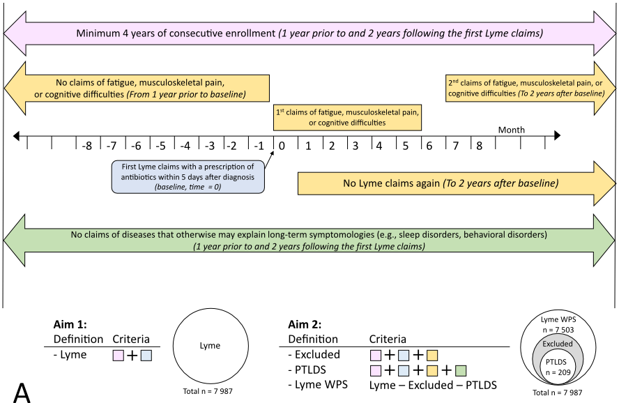
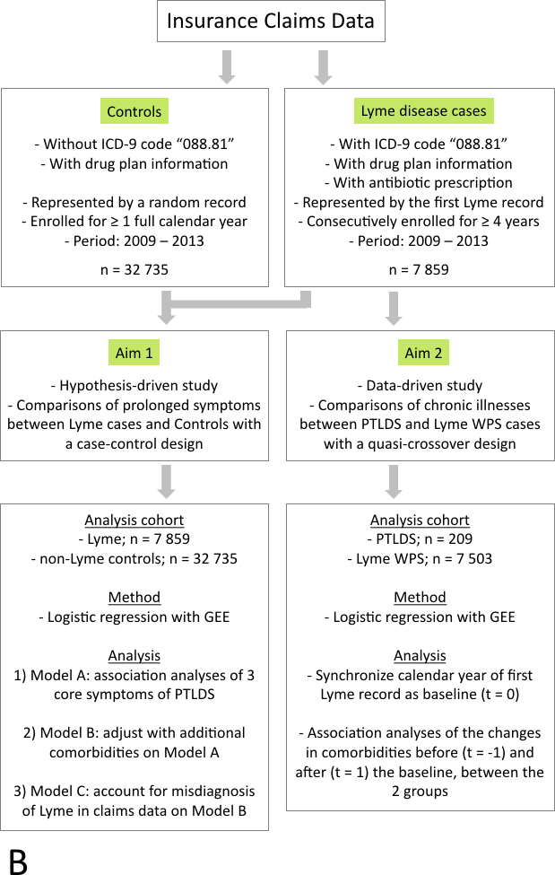

# Epidemiological Study of Post-Treatment Lyme Disease Syndrome with Large Medical Claims Data

<!--
*Submitted for peer review, Fall 2017*
-->

<!--
## Authors
- Ming Kei (Jake) Chung
  - github: [\@jakemkc](http://github.com/jakemkc)
  - twitter: [\@jakekei](http://twitter.com/jakekei)
  - email: jake_chung[at]hms[dot]harvard[dot]edu
- Germaine M. Buck Louis
  - email: glouis[at]gmu[dot]edu
- Kurunthachalam Kannan
  - email: kurunthachalam[dot]kannan[at]health[dot]ny[dot]gov
- Chirag J. Patel
  - github: [\@chiragjp](http://github.com/chiragjp)
  - web: [www.chiragjpgroup.org](http://www.chiragjpgroup.org)
--> 

## Figure 1A

Figure 1. Case definitions and analytical workflow in the current study. 
A: Case definitions of Lyme, post-treatment Lyme disease syndrome (PTLDS), and Lyme disease without prolonged symptoms (WPS) from claims data. We used progressive procedures to extract the cases. I) For Lyme disease cases, we started from identifying the first Lyme disease record of each patient in the database (ICD = 088.81; light blue shading). We filtered the patients with 2 additional criteria. First, they must have drug plan information available and with an antibiotic prescription record within 5 days after the first Lyme disease diagnosis. Second, the individuals had to be consecutively enrolled in the national managed health care plan for at least 1 year prior to and 2 years following the first Lyme disease records. The first Lyme diagnosis records were used to represent Lyme (for Aim 1), PTLDS and Lyme WPS patients (for Aim 2) in the analysis. II) For PTLDS, cases were defined successively by adding new inclusion (light yellow shading) and exclusion criteria (light green shading) on top of Lyme disease cases. We filtered for Lyme patients who 1) did not complain for any one of the core PTLDS symptoms -- chronic fatigue, cognitive impairment, and musculoskeletal pain -- 1 year prior to the baseline; 2) did not have another Lyme record from 1 month following the baseline, and 3) complained for any one of the core PTLDS symptoms within 6 months and after the 7th month from the baseline. Furthermore, PTLDS cases must not match any one of the exclusion symptoms (i.e., potentially confounding) such as autoimmune disease, liver disease, and cancer that are proposed by the Infectious Diseases Society of America (2006). III) For Lyme WPS, cases were defined by removing those 1) with prolonged symptoms and potentially confounding conditions and 2) defined as PTLDS cases from Lyme disease patients.

## Figure 1B

B: Overview of the data extraction and analytical procedures. We first extracted Lyme disease cases and non-Lyme controls from the claims data. We required Lyme disease patients to have a longer enrollment criterion because of the longitudinal comorbidity analysis in Aim 2. For Aim 1: We analyzed the associations of three prolonged symptoms (chronic fatigue, cognitive impairment, musculoskeletal pain) with Lyme disease with logistic regression and used generalized estimating equations (GEE) to handle correlation between ZIP Codes (Model A). We assessed the robustness of our findings with 2 other models. First, we ran the analyses of 36 conditions and identified 4 significant conditions associated with Lyme disease. We reran Model A with these conditions as additional covariates (Model B). Then, we estimated the misdiagnosis rate of Lyme disease in claims data from the literature. We reduce 70% of the Lyme disease cases and reran Model B (Model C). For Aim 2: we compared the common chronic conditions between patients of PTLDS and Lyme WPS. We first synchronized the calendar year of the first Lyme claims records as baseline. Then, to identify comorbidity clusters uniquely associated with PTLDS, we analyzed the changes of 19 comorbidities 1-year before and 1-year after the baseline between the 2 groups.

 
 
 
