# Epidemiological Study of Post-Treatment Lyme Disease Syndrome with Large Medical Claims Data

<!--
*Submitted for peer review, Fall 2017*
-->

<!--
## Authors
- Ming Kei (Jake) Chung
  - github: [\@jakemkc](http://github.com/jakemkc)
  - twitter: [\@jakekei](http://twitter.com/jakekei)
  - email: jake_chung[at]hms[dot]harvard[dot]edu
- Germaine M. Buck Louis
  - email: glouis[at]gmu[dot]edu
- Kurunthachalam Kannan
  - email: kurunthachalam[dot]kannan[at]health[dot]ny[dot]gov
- Chirag J. Patel
  - github: [\@chiragjp](http://github.com/chiragjp)
  - web: [www.chiragjpgroup.org](http://www.chiragjpgroup.org)
--> 

## Figure 3
 

 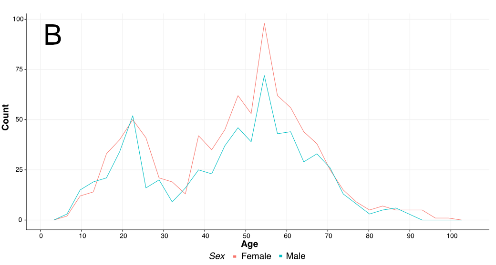

Figure 3. Age distribution of Lyme diseases. A: Lyme disease; B: PTLDS. We counted the number of patients by age (X axis) and by sex (red line: female; turquoise line: male). 

## Figure 4
 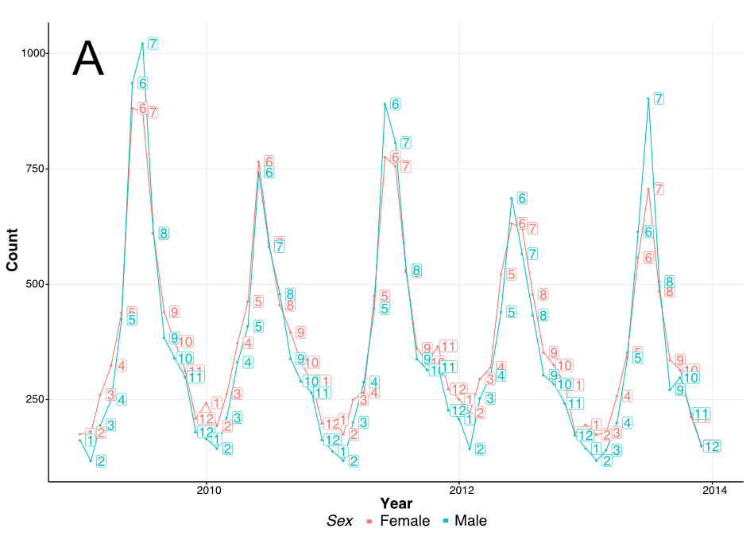

 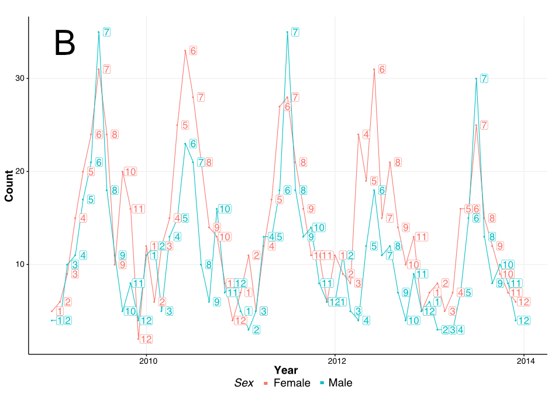

Figure 4. Temporal changes of Lyme diseases. A: Lyme disease; B: PTLDS. We counted the number of patients by year (X axis, 2009 to 2013) and by sex (red line: female; turquoise line: male). Numbers shown in the plots represent the corresponding months of the year.

## Figure 5
 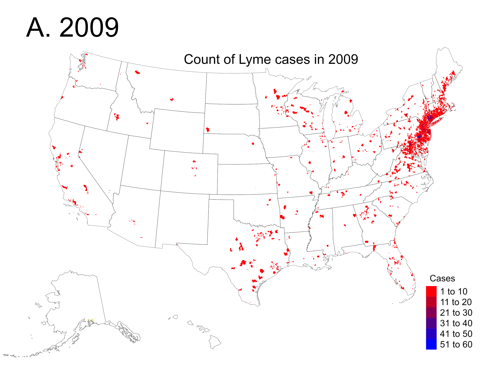

 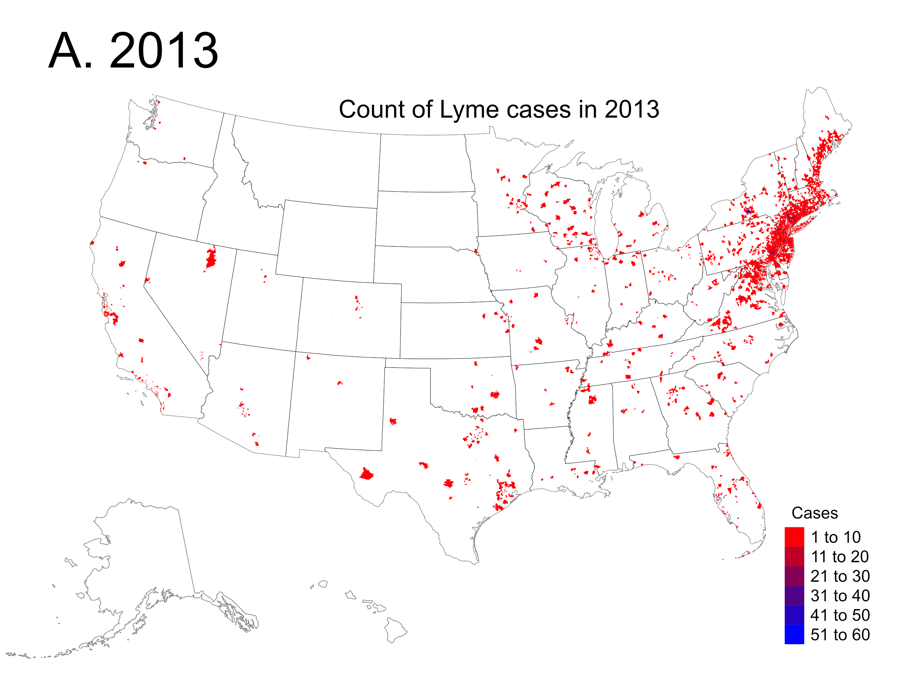

 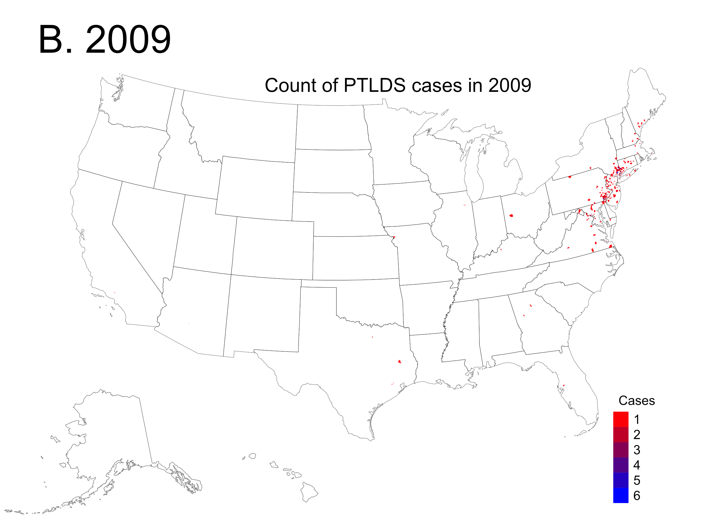

 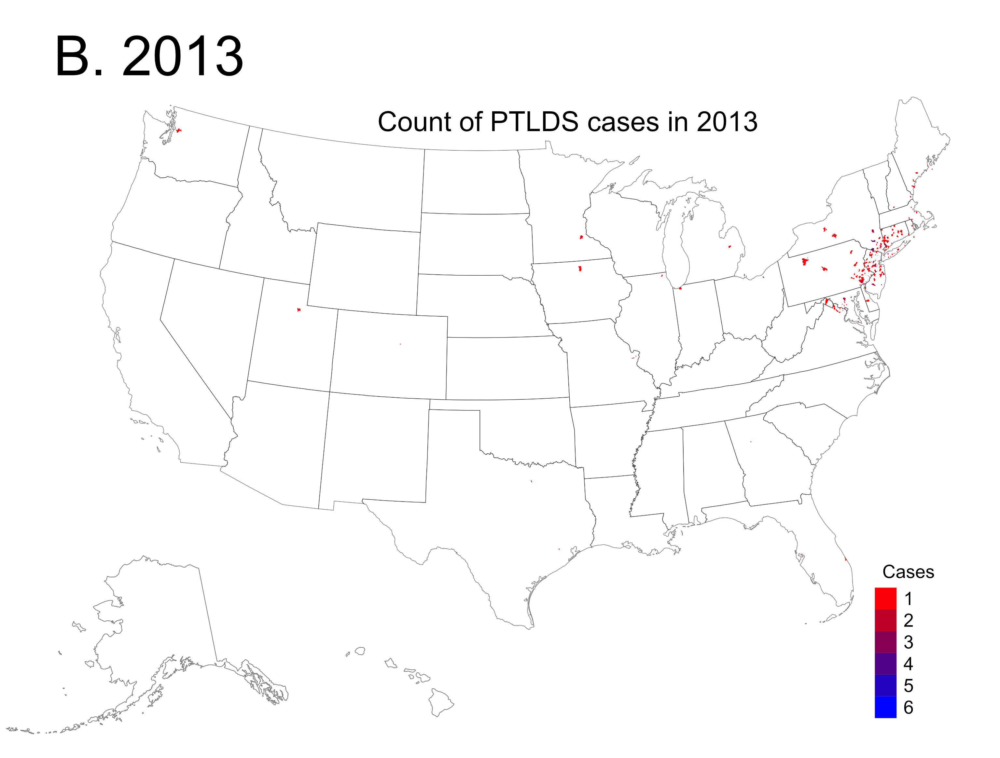

Figure 5. Spatial distribution of Lyme diseases. A: Lyme disease; B: PTLDS. We counted the number of patients in each ZIP Code Tabulation Areas. Distributions in 2009 and 2013 are shown.
 

## Figure 6
 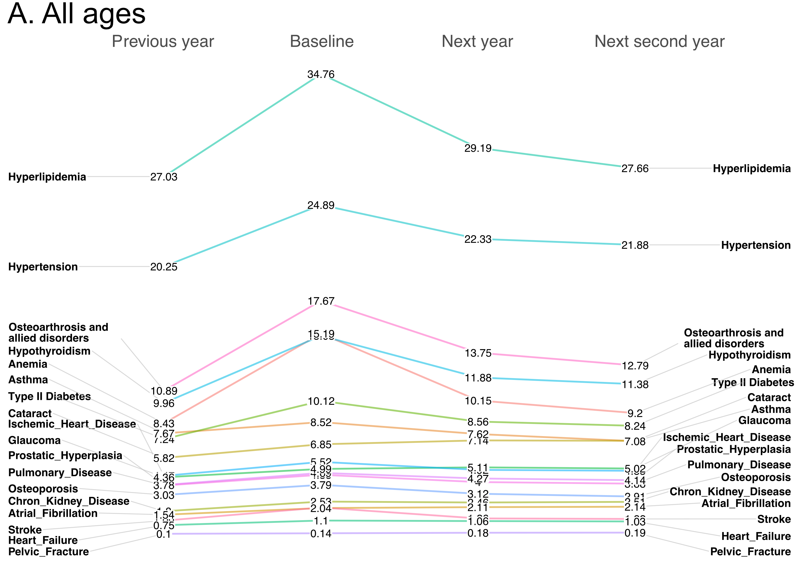

 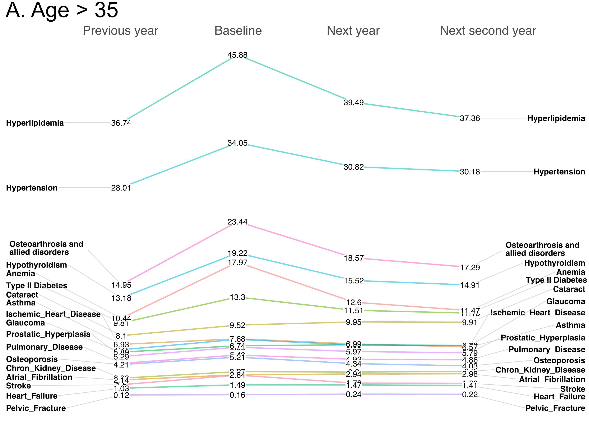

 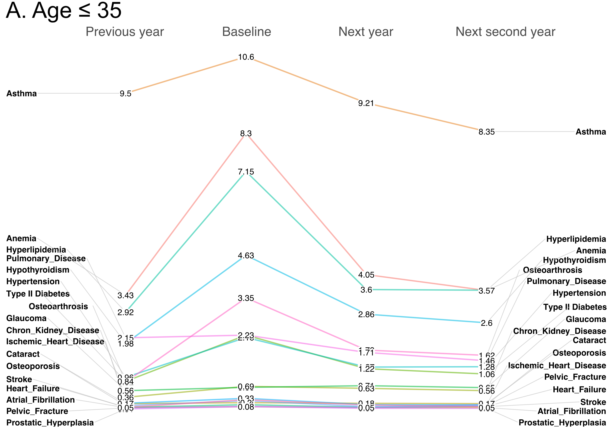

 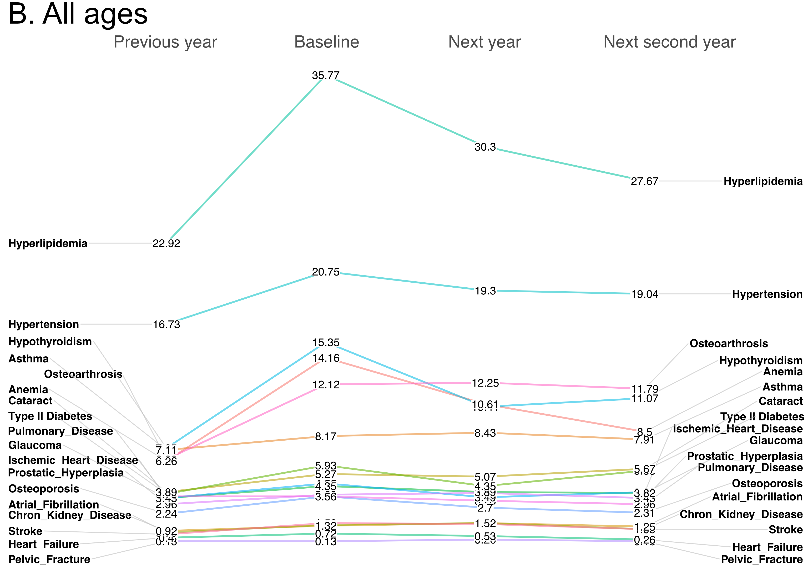

 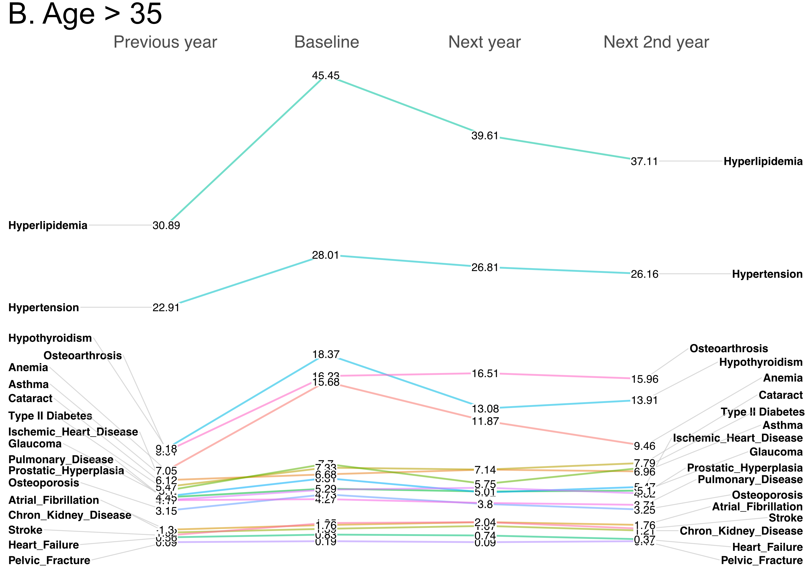

 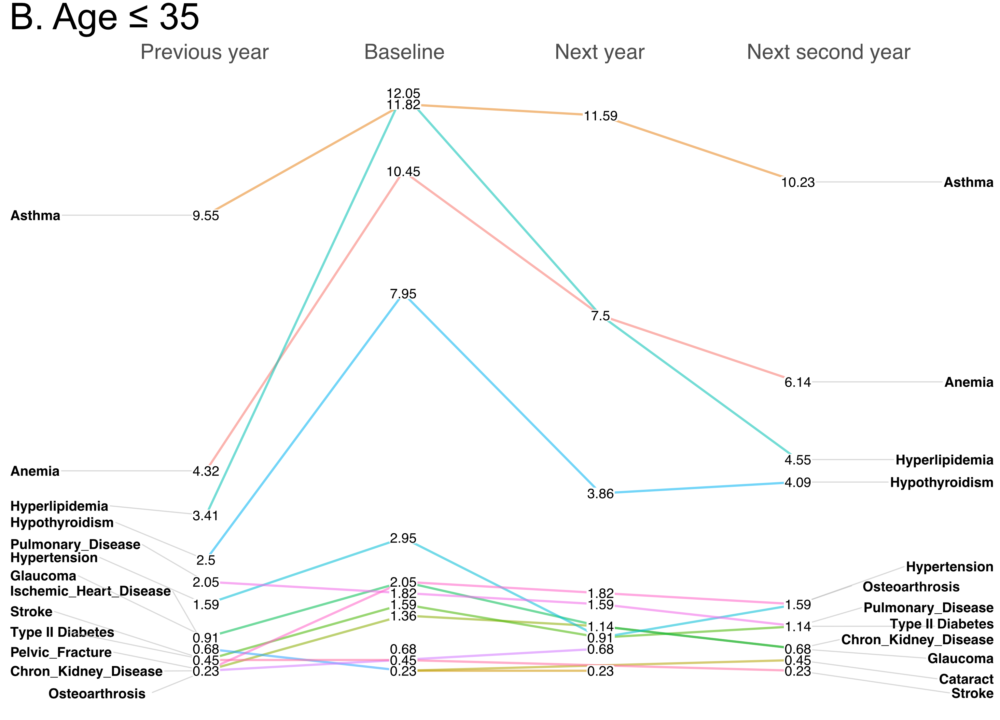

Figure 6. Slopegraph showing the changes in 19 comorbidity of Lyme diseases. A: Lyme disease; B: PTLDS. From top to bottom: all ages, age ≤ 35, and age > 35. We tracked the comorbidity records of 44 420 Lyme and 1518 PTLDS patients, and the numbers shown in the figures represent the percentage of patients with the corresponding comorbidity in a particular period. In each plot, a 4-year period is shown, starting from one year before and 2 years after the baseline.  

 
 
 
