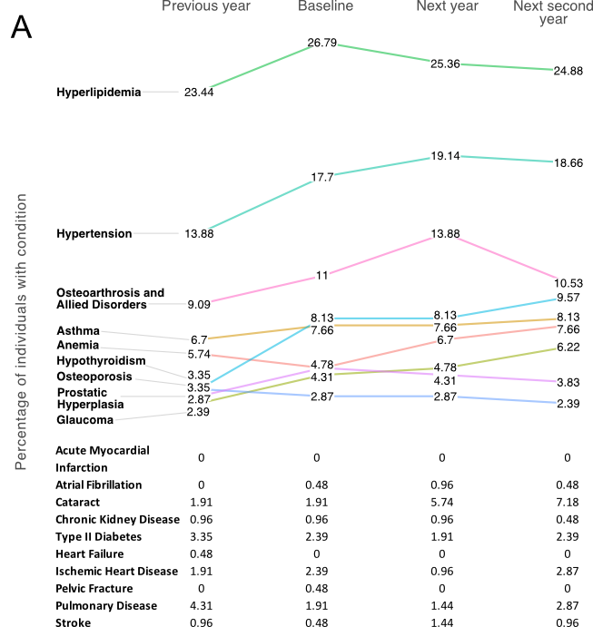
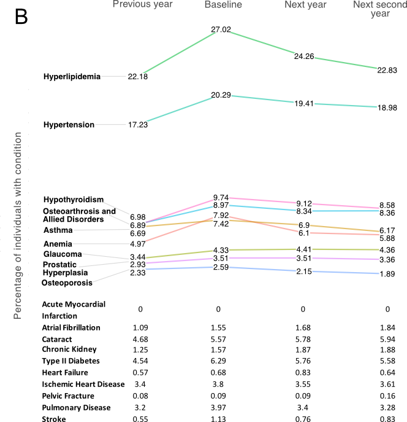

# Epidemiological Study of Post-Treatment Lyme Disease Syndrome with Large Medical Claims Data

<!--
*Submitted for peer review, Fall 2017*
-->

<!--
## Authors
- Ming Kei (Jake) Chung
  - github: [\@jakemkc](http://github.com/jakemkc)
  - twitter: [\@jakekei](http://twitter.com/jakekei)
  - email: jake_chung[at]hms[dot]harvard[dot]edu
- Germaine M. Buck Louis
  - email: glouis[at]gmu[dot]edu
- Kurunthachalam Kannan
  - email: kurunthachalam[dot]kannan[at]health[dot]ny[dot]gov
- Chirag J. Patel
  - github: [\@chiragjp](http://github.com/chiragjp)
  - web: [www.chiragjpgroup.org](http://www.chiragjpgroup.org)
--> 

## Figure 2

Figure 2. Temporal changes of 19 comorbidities in A) PTLDS and B) Lyme without prolonged symptoms (WPS) patients. We synchronized the calendar year of the first Lyme claims records of PTLDS and Lyme WPS patients as baseline, and tracked the comorbidity records before and after the baseline. Changes are shown in a 4-year period, starting from 1 year before and 2 years after the baseline. For clarity, only the top 9 comorbidities with largest sample size are shown in the slopegraphs and the rest are presented in tabular format. The numbers shown in the figures represent the percentage of patients with the corresponding comorbidity in a particular period. The enrichment of conditions at the baseline is due to the 100% contact rate of the patients with the health care system.

 
